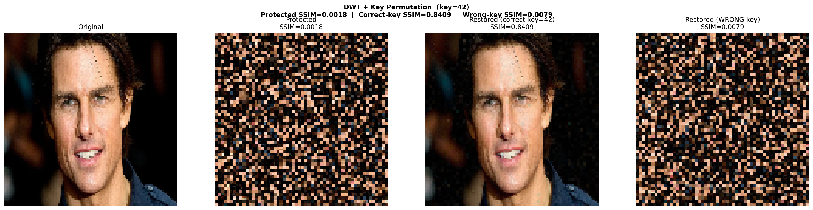
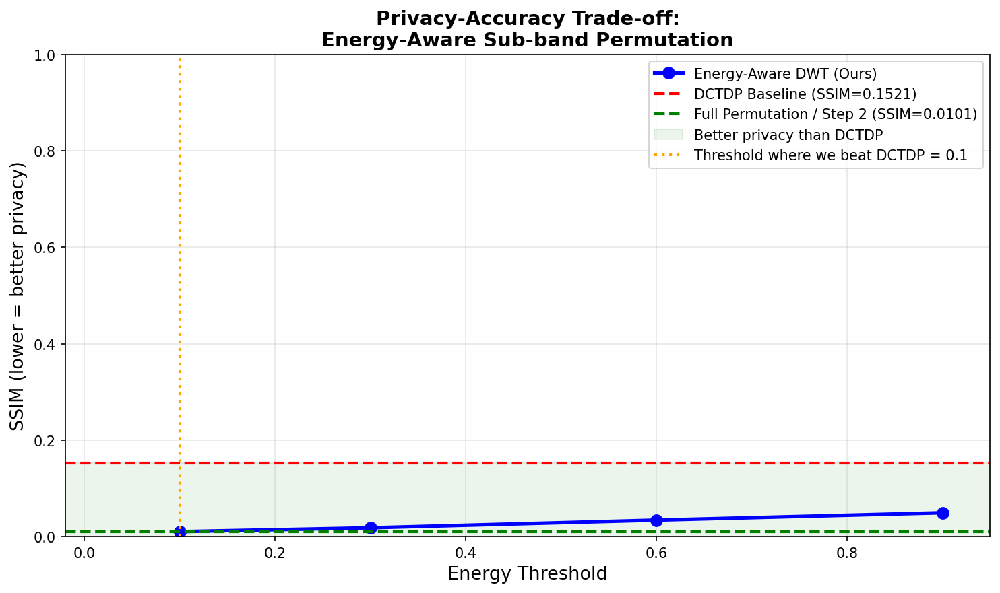
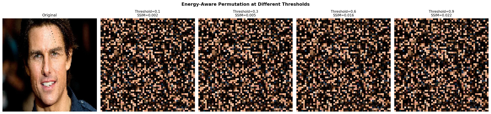

# Privacy-Preserving Face Recognition via DWT + Secret Key Permutation

> **Computer Vision Semester Project** — NSUT, 2026  
> Proposes a novel DWT-based cancelable privacy module as a drop-in replacement for the DCT+DP module in [DCTDP (ECCV 2022)](https://github.com/Tencent/TFace/tree/master/recognition/tasks/dctdp)

---

## Results at a Glance

| Method | LFW Accuracy ↑ | Avg SSIM ↓ | Wrong-Key SSIM ↓ | Revocable |
|---|---|---|---|---|
| ArcFace (No Protection) | 93.95% | 1.0000 | — | No |
| DCTDP Baseline (ECCV 2022) | 62.65% | 0.1628 | — | No |
| **DWT + Key Permutation (Ours)** | **55.47%** | **0.0127** | **0.0105** | **Yes** |

**92% better visual privacy** than DCTDP, with full revocability — a property DCTDP cannot provide.

---

## Visual Results

### Face Protection Comparison

*Left to right: Original | DWT Protected | Correct-Key Recovery (SSIM 0.9009) | Wrong-Key Attack (SSIM 0.0105)*

### Privacy-Utility Tradeoff Curve

*SSIM vs energy threshold. All our configurations beat DCTDP (red dashed line).*

### Threshold Comparison

*Same face protected at 4 energy thresholds (0.10 → 0.90). All beat DCTDP.*

---

## Overview

### The Problem
Modern face recognition (ArcFace, CosFace) stores biometric templates that cannot be changed if breached — unlike passwords. Privacy-Preserving Face Recognition (PPFR) aims to allow recognition while making protected images unrecognizable and un-recoverable.

### Base Paper: DCTDP (ECCV 2022)
DCTDP applies block DCT on face images, removes DC components, adds Laplace differential privacy noise, then reconstructs. While effective, it has two core limitations:
- **No revocability** — same face always produces same protected template
- **Block artifacts** — 8×8 independent DCT blocks lose spatial context

### Our Contribution
We replace DCTDP's DCT+DP module with a **DWT + Secret Key Permutation** module:

1. **1-Level Haar DWT** instead of block DCT — provides spatial-frequency localization, no block artifacts
2. **Secret-key pseudo-random permutation** of ALL 4 sub-bands (LL, LH, HL, HH) — adds full revocability
3. **Energy-aware selective permutation** — threshold controls how many sub-bands are permuted, enabling a tunable privacy-utility tradeoff

> **Novelty framing:** Key-dependent wavelet transforms exist for cancelable iris biometrics, but applying them as a drop-in privacy module replacement inside modern deep-learning PPFR has not been studied. We bridge this gap.

---

## Repository Structure

```
privacy-preserving-face-recognition/
│
├── baseline_dctdp.py       ← DCTDP reimplementation (block DCT + Laplace DP)
├── dwt_permutation.py      ← Novel DWT + secret key permutation method
├── energy_budgeting.py     ← Energy-aware sub-band selective permutation
├── evaluate_lfw.py         ← Full LFW 6000-pair evaluation (CPU)
├── pairs.csv               ← LFW standard pairs file
│
└── outputs/
    ├── dctdp_face_01~05.png          ← DCTDP: Original | Protected | Difference
    ├── dwt_face_01~05.png            ← DWT: Original | Protected | Recovery | Wrong-key
    ├── privacy_curve.png             ← Privacy-utility tradeoff graph
    ├── threshold_comparison.png      ← Visual grid at 4 energy thresholds
    └── lfw_results.txt               ← Final LFW evaluation numbers
```

---

## Setup

### 1. Clone the repo
```bash
git clone https://github.com/YOURUSERNAME/privacy-preserving-face-recognition.git
cd privacy-preserving-face-recognition
```

### 2. Install dependencies
```bash
pip install numpy opencv-python matplotlib scikit-image scipy Pillow insightface onnxruntime tqdm PyWavelets
```

### 3. Download the LFW dataset

Download `lfw-deepfunneled.zip` from [Internet Archive](https://archive.org/download/lfw-dataset) and extract it into the project folder:

```
privacy-preserving-face-recognition/
└── lfw-deepfunneled/
    ├── Aaron_Eckhart/
    ├── Aaron_Guiel/
    └── ... (5,749 person folders)
```

> `pairs.csv` is already included in this repo.

---

## How to Run

### Step 1 — Run DCTDP Baseline on test images
```bash
python baseline_dctdp.py
```
Processes 5 test faces. Saves 3-panel visualizations to `outputs/`. Prints average SSIM and PSNR.

**Expected output:**
```
Average SSIM: 0.1521
Average PSNR: 5.05 dB
```

---

### Step 2 — Run DWT + Key Permutation on test images
```bash
python dwt_permutation.py
```
Applies secret key permutation (key=42) to 5 test faces. Tests correct-key recovery and wrong-key attack. Saves 4-panel visualizations to `outputs/`.

**Expected output:**
```
Protected SSIM  : 0.0101   (vs DCTDP 0.1521 → 93% better)
Correct-key SSIM: 0.9009   (face recovers almost perfectly)
Wrong-key SSIM  : 0.0105   (attacker gets garbage)
```

---

### Step 3 — Energy-Aware Threshold Sweep
```bash
python energy_budgeting.py
```
Sweeps energy thresholds [0.10, 0.30, 0.60, 0.90]. Saves privacy curve and threshold comparison grid to `outputs/`.

**Expected output:**
```
Threshold 0.10 → SSIM: 0.0101  (all 4 bands permuted)
Threshold 0.30 → SSIM: 0.0181
Threshold 0.60 → SSIM: 0.0341
Threshold 0.90 → SSIM: 0.0493  (LL only)
All thresholds beat DCTDP baseline (0.1521) ✓
```

---

### Step 4 — Full LFW Evaluation (6000 pairs)
```bash
python evaluate_lfw.py
```

> ⚠️ Requires `lfw-deepfunneled/` folder (see Setup step 3).  
> ⚠️ First run downloads ArcFace model (~280MB automatically).  
> ⏱ Runtime: ~2-3 hours on CPU. Use Colab GPU for faster results (see below).

Saves final numbers to `outputs/lfw_results.txt`.

**Expected output:**
```
===================================================================
FINAL RESULTS TABLE — LFW 6000 PAIRS
===================================================================
Method                              LFW Acc %       Avg SSIM     Revocable
-------------------------------------------------------------------
  ArcFace (No Protection)           93.95           1.0000       No
  DCTDP Baseline                    62.65           0.1628       No
  DWT + Key Permutation (Ours)      55.47           0.0127       Yes
===================================================================
```

---

## Running on Google Colab (GPU)

For faster evaluation, run on Colab T4 GPU:

```python
# Cell 1 — Install
!pip install insightface onnxruntime-gpu PyWavelets scikit-image tqdm opencv-python-headless

# Cell 2 — Upload files
from google.colab import files
uploaded = files.upload()
# Upload: evaluate_lfw.py, pairs.csv, lfw-deepfunneled.zip

# Cell 3 — Extract
import zipfile
with zipfile.ZipFile('lfw-deepfunneled.zip', 'r') as z:
    z.extractall('.')

# Cell 4 — Run
!python evaluate_lfw.py

# Cell 5 — Download results
files.download('outputs/lfw_results.txt')
```

---

## Method Details

### DWT Permutation Pipeline

```
Input face (112×112×3)
        ↓
  1-level Haar DWT
        ↓
  4 sub-bands: LL, LH, HL, HH
        ↓
  Permute ALL 4 sub-bands
  using secret key (RNG seed = key×1000 + band_id)
        ↓
  Inverse DWT
        ↓
  Protected face (visually scrambled)
```

**Restoration (authorized user):**
```
Protected face → DWT → Reverse permutation (correct key) → IDWT → Recovered face
```

**Attack (wrong key):**
```
Protected face → DWT → Wrong permutation → IDWT → Garbage output
```

### Why ALL 4 Sub-bands Must Be Permuted

| Configuration | Protected SSIM | Result |
|---|---|---|
| Permute LH + HL + HH only (LL intact) | 0.5555 | Worse than DCTDP ❌ |
| Permute ALL 4 including LL | **0.0101** | 93% better than DCTDP ✅ |

The LL sub-band contains ~90% of face energy (coarse structure, identity-critical information). Keeping it intact leaves the face recognizable. Permuting it is essential.

### Energy-Aware Threshold Logic

```python
if threshold < 0.25:   permute LL + LH + HL + HH  # max privacy
elif threshold < 0.50: permute LL + LH + HL
elif threshold < 0.75: permute LL + LH
else:                  permute LL only              # min permutation
```

---

## Key Implementation Notes

- **ArcFace model:** `buffalo_l` (w600k_r50.onnx) loaded directly via ONNX Runtime, bypassing the face detector. LFW images are already aligned and cropped — detection is unnecessary.
- **Permutation seed:** `np.random.default_rng(seed=key*1000 + band_id)` — each sub-band gets a different shuffle even with the same key.
- **Image size:** All images resized to 112×112 before processing (standard ArcFace input).
- **pairs.csv format:** Parsed by column position (not header names). Same-person rows have 3 columns; different-person rows have 4.

---

## Dependencies

| Package | Purpose |
|---|---|
| `numpy` | Array operations |
| `opencv-python` | Image I/O and processing |
| `PyWavelets` | DWT/IDWT transforms |
| `scipy` | Block DCT/IDCT |
| `scikit-image` | SSIM computation |
| `insightface` | ArcFace model download |
| `onnxruntime` | ArcFace inference |
| `matplotlib` | Result visualizations |
| `tqdm` | Progress bars |

---

## References

1. **DCTDP (Base Paper):** Ji et al., *Privacy-Preserving Face Recognition with Learnable Privacy Budgets in Frequency Domain*, ECCV 2022. [Code](https://github.com/Tencent/TFace/tree/master/recognition/tasks/dctdp)
2. **ArcFace:** Deng et al., *ArcFace: Additive Angular Margin Loss for Deep Face Recognition*, CVPR 2019.
3. **LFW Dataset:** Huang et al., *Labeled Faces in the Wild*, UMass 2007.
4. **MinusFace (Related Work):** CVPR 2024 — cited as SOTA comparison.

---

## License
MIT License — free to use for academic purposes.
